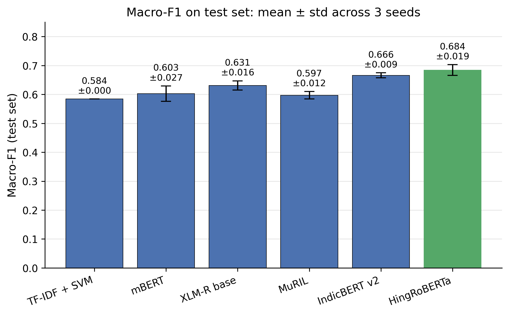

# HASOC 2021 Subtask 1: Multilingual Transformer Benchmark

A reproducible benchmark of five multilingual / Indic-specialized transformer models plus a TF-IDF baseline on the [HASOC 2021](https://hasocfire.github.io/hasoc/2021/) Subtask 1 hate-speech detection dataset (English–Hindi code-mixed Twitter).

We compare **TF-IDF + Linear SVM**, **mBERT**, **XLM-RoBERTa**, **MuRIL**, **IndicBERT v2**, and **HingRoBERTa** on binary HOF (hate-or-offensive) vs. NONE classification, using a conversation-level stratified split. All transformer experiments report mean ± standard deviation across three random seeds.


---

## Key Findings

<p align="center">
  
</p>

| Rank | Model | Test Macro-F1 | Std | Params |
|:---:|---|:---:|:---:|:---:|
| 🥇 | **HingRoBERTa** (`l3cube-pune/hing-roberta`) | **0.6842** | ±0.0186 | 278M |
| 🥈 | IndicBERT v2 (`ai4bharat/IndicBERTv2-MLM-only`) | 0.6659 | ±0.0086 | 278M |
| 🥉 | XLM-R base (`xlm-roberta-base`) | 0.6309 | ±0.0161 | 278M |
| 4 | mBERT (`bert-base-multilingual-cased`) | 0.6027 | ±0.0269 | 178M |
| 5 | MuRIL (`google/muril-base-cased`) | 0.5973 | ±0.0125 | 238M |
| 6 | TF-IDF + Linear SVM (baseline) | 0.5840 | — † | — |

† TF-IDF + SVM is deterministic given fixed training data; the model produces identical predictions across all three seeds.

**Takeaways:**

- **Domain-specific pretraining beats broader language coverage.** HingRoBERTa, pretrained on Hinglish Twitter, outperforms general multilingual XLM-R by 5.3 macro-F1 points and the TF-IDF baseline by 10 points.
- **MuRIL underperforms despite being Indic-specialized.** We attribute this to a domain mismatch: MuRIL's training corpus emphasizes formal Hindi (news, Wikipedia) while HASOC 2021 contains conversational Twitter Hinglish.
- **mBERT and MuRIL barely beat the TF-IDF baseline** (< 2 F1 points), suggesting that for this dataset, generic multilingual pretraining offers limited advantage over a strong classical model. The gap only opens up with Indic-aware (IndicBERT) or Hinglish-aware (HingRoBERTa) pretraining.
- **Better models also have lower variance.** HingRoBERTa, IndicBERT, and MuRIL all have standard deviations below 0.02, while mBERT's variance is roughly 1.5× higher.

---

## Task Definition

Let **S** = {s₁, s₂, …, s_n} be a set of *n* input tweets in code-mixed English–Hindi, and **L** = {l₁, l₂, …, l_n} be the corresponding labels, where each l_i ∈ {HOF, NONE}. The label **HOF** indicates the tweet contains hate speech, offensive language, or profanity; **NONE** indicates the tweet contains none of these. The task is to learn a function *f*: S → L that predicts P(l|s), the conditional probability of label l given tweet s.

---

## Repository Structure

```
.
├── src/
│   ├── load_data.py          # Walk HASOC folder tree → unified CSV
│   ├── clean.py              # Twitter + Hinglish text cleaning
│   ├── split_data.py         # Conversation-level stratified split
│   ├── train_tfidf.py        # TF-IDF + Linear SVM baseline
│   ├── train_transformer.py  # Unified fine-tuning for all transformers
│   ├── aggregate_results.py  # Build mean ± std results table
│   └── make_figures.py       # Generate paper-ready figures
├── results/                  # Per-run metrics & confusion matrices
├── figures/                  # Generated visualizations
├── results_summary.csv       # Aggregated table (paper-ready)
├── results_summary_latex.tex # LaTeX-formatted table
├── requirements.txt
└── README.md
```

---

## Dataset

> ⚠️ **The HASOC 2021 dataset is not redistributed in this repository** due to its license. To reproduce these results, you must obtain the data directly from the organizers.

**Obtaining the data:**

1. Register at the [HASOC 2021 official site](https://hasocfire.github.io/hasoc/2021/) and accept the data use agreement.
2. Place the conversation folders at:
   ```
   data/train/<topic>/<conversation_id>/data.json
   data/train/<topic>/<conversation_id>/labels.json
   ```

**Dataset statistics:**

| Property | Value |
|---|---|
| Conversations | 82 |
| Tweets (total) | 3,860 |
| Topics | 8 (`bantwitter`, `casteism`, `charlie hebdo`, `Covid Crisis`, `indian politics`, `Israel`, `religious controversies`, `wuhan virus`) |
| Label distribution | 51.6% NONE / 48.4% HOF |
| Avg. tweets per conversation | ~47 |

**Train/val/test split** (conversation-level, stratified on topic × hate-ratio tercile, fixed seed):

| Split | Conversations | Tweets | HOF % |
|:---:|:---:|:---:|:---:|
| Train | 66 | 2,981 | 46.5% |
| Val | 8 | 578 | 55.7% |
| Test | 8 | 301 | 53.2% |

---

## Setup

**Requirements:** Python 3.10, CUDA-capable GPU (8+ GB recommended).

```bash
# Create a clean conda environment
conda create -n hasoc python=3.10 -y
conda activate hasoc

# Install PyTorch with CUDA (adjust cu128 to match your driver)
pip install torch torchvision torchaudio --index-url https://download.pytorch.org/whl/cu128

# Install remaining dependencies
pip install -r requirements.txt

# Verify GPU access
python -c "import torch; print('CUDA:', torch.cuda.is_available())"
```

---

## Reproducing the Benchmark

### 1. Preprocess the dataset

```bash
# Walk the HASOC folder tree into a unified CSV
python src/load_data.py --train_dir data/train

# Conversation-level stratified 80/10/10 split (held fixed across all models)
python src/split_data.py --input data/processed/full_train.csv --seed 2
```

### 2. Train the models

Each transformer is trained with three random seeds (42, 123, 2024). Best epoch is selected by validation macro-F1.

**TF-IDF baseline (CPU, < 1 minute total):**

```bash
for seed in 42 123 2024; do
  python src/train_tfidf.py --seed $seed
done
```

**Local GPU (mBERT, XLM-R, MuRIL):**

```bash
for seed in 42 123 2024; do
  python src/train_transformer.py --model bert-base-multilingual-cased --seed $seed --epochs 5
  python src/train_transformer.py --model xlm-roberta-base --seed $seed --epochs 5
  python src/train_transformer.py --model google/muril-base-cased --seed $seed --epochs 5
done
```

**Colab T4 (IndicBERT, HingRoBERTa):**

```bash
for seed in 42 123 2024; do
  python src/train_transformer.py --model ai4bharat/IndicBERTv2-MLM-only --seed $seed --epochs 5 --batch_size 32
  python src/train_transformer.py --model l3cube-pune/hing-roberta --seed $seed --epochs 5 --batch_size 32
done
```

### 3. Aggregate and visualize

```bash
python src/aggregate_results.py    # writes results_summary.csv + LaTeX table
python src/make_figures.py         # writes figures/*.png
```

---

## Methodology Summary

**Preprocessing.** Tweets are cleaned with a conservative pipeline that preserves casing, emojis, and Devanagari script: NFC Unicode normalization, HTML entity decoding, zero-width character removal, URL → `<URL>` placeholder, mention → `<USER>` placeholder, hashtag de-prefixing (`#word` → `word`), repeated-character collapse (`looool` → `lool`), whitespace normalization. Stopword removal and lemmatization are deliberately *not* applied, as they remove signal that subword tokenizers handle natively.

**Splitting.** We use an 80/10/10 split at the **conversation level** (not tweet level) to prevent leakage from shared discourse context. The split is stratified jointly on (i) topic and (ii) terciled per-conversation hate-ratio, allocated globally via largest-remainder rounding so fold sizes are exact and label balance is preserved across folds.

**Training.** All transformers share an identical recipe: AdamW optimizer with learning rate 2e-5, weight decay 0.01, warmup ratio 0.1, max sequence length 128, mixed-precision (fp16), 5 epochs. Class-weighted cross-entropy handles the modest imbalance. Best checkpoint is selected by validation macro-F1; final test metrics use this best-epoch model.

**TF-IDF baseline.** Word-level n-grams (1, 2) with `min_df=2`, `max_df=0.95`, sublinear TF; LinearSVC with balanced class weighting. Lowercased and emoji-stripped (in contrast to the transformer pipeline, which retains both).

**Hardware.** Local: NVIDIA RTX 2060 SUPER (8 GB) for TF-IDF, mBERT, XLM-R, and MuRIL. Colab: NVIDIA Tesla T4 (16 GB) for IndicBERT v2 and HingRoBERTa.

---

## Outputs

After training, each run produces:

- `results/<model>_seed<N>/metrics.json` — test metrics (macro-F1, precision, recall, binary-F1, accuracy, training time)
- `results/<model>_seed<N>/classification_report.txt` — per-class precision/recall/F1
- `results/<model>_seed<N>/confusion_matrix.npy` — 2×2 confusion matrix
- `results/<model>_seed<N>/predictions.csv` — per-tweet predictions (kept locally; not committed)

After aggregation:

- `results_summary.csv` — mean ± std per model
- `results_summary_raw.csv` — every individual run
- `results_summary_latex.tex` — paper-ready LaTeX table
- `figures/macro_f1_comparison.png` — primary results figure
- `figures/confusion_matrices_aggregated.png` — error patterns by model
- `figures/per_class_f1.png` — HOF vs NONE F1 breakdown

---

## Limitations

- **No official test labels.** The official HASOC 2021 test set was not released with labels to our cohort. We therefore evaluate on a held-out 10% conversation-level split of the training data. Numbers are not directly comparable to leaderboard scores from other HASOC 2021 papers.
- **Three seeds.** With small datasets, three seeds is the minimum for reasonable variance estimation; five would tighten confidence intervals further.
- **Train/test HOF imbalance (~6.7 pp).** Due to the small number of conversations (82), the stratification can only approximately balance fold composition. This may slightly underestimate absolute model performance, though relative comparisons remain valid.
- **No hyperparameter tuning per model.** All transformers share identical training hyperparameters to ensure fair comparison; per-model tuning could change relative rankings.

---

## Citation

If you use this code or build on these results, please cite:

```bibtex
@misc{hasoc2021_benchmark,
  author = {Your Name},
  title  = {HASOC 2021 Subtask 1: Multilingual Transformer Benchmark},
  year   = {2026},
  url    = {https://github.com/<your-username>/<repo-name>},
}
```

Please also cite the original HASOC 2021 shared task and the pretrained models you use.

---

## License

Code is released under the [MIT License](LICENSE). The HASOC 2021 dataset is **not** included and is governed by its own license terms — see [the HASOC site](https://hasocfire.github.io/hasoc/2021/) for details.

---

## Acknowledgments

- HASOC 2021 organizers for the dataset
- Hugging Face for `transformers` and the model hub
- AI4Bharat ([IndicBERT](https://github.com/AI4Bharat/IndicBERT)), Google ([MuRIL](https://huggingface.co/google/muril-base-cased)), and L3Cube ([HingRoBERTa](https://huggingface.co/l3cube-pune/hing-roberta)) for releasing pretrained models
